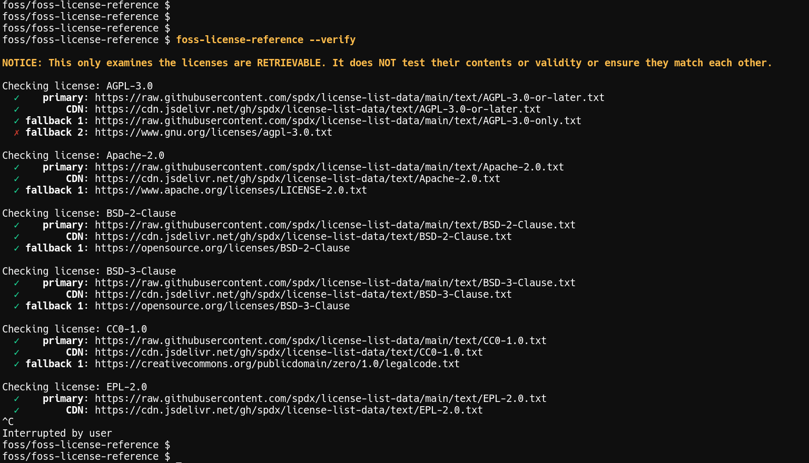

# License Matrix Tool

*Because choosing a software license shouldn't require a law degree.*

A Perl-powered license comparison matrix that actually works when gpl.org inevitably goes down again.

## What it does

Shows you a nice table comparing software licenses across the dimensions that actually matter to developers. Also downloads license texts for you, because copy-pasting from random websites is how security incidents happen.

<div align="center">
  <em>Review options...</em><br>
  <br>

</div>
<div align="center">
  <em>Download as LICENSE text file.</em><br>
  <br>

</div>
<div align="center">
  <em>What's it mean?</em><br>
  <br>
</div>


You can `--verify` the included URLs' as well (see screenshot of that below)


## Quick start

```bash
# See the matrix
./license-tool

# Download a license (case doesn't matter, we're not monsters)
./license-tool -r mit
./license-tool -r GPL-3.0
./license-tool -r wtfpl

# Check if the internet still works
./license-tool --verify
```

## Why this exists

1. License comparison charts on the web are either wrong, incomplete, or hosted on someone's Geocities page
2. gpl.org has a habit of going offline at inconvenient moments
3. Sometimes you just want to grab the actual license text without clicking through 47 "I Accept" dialogs

## Features

- **Fallback mirrors**: SPDX GitHub → CDN → Original sources (in that order of reliability)
- **Timeout handling**: 5-second curl timeouts because life's too short
- **Case-insensitive lookups**: `mit` = `MIT` = `MiT` (we're not barbarians)
- **Verbose mode**: For when you want to see the sausage being made

<div align="center">
  <em>Verify License URLs</em><br>
  <br>
</div>

## Options

```
-r, --retrieve LICENSE_ID    Download license text as 'LICENSE'
-v                          Verbose (add more v's for more verbosity)
-l, --long                  Show extended columns
--verify                    Check if mirrors are alive
-C                          Disable colors (for the fun-averse)
-h, --help                  The usual
```

## Column Legend

The matrix shows permissions (✓) and restrictions (✗) across various dimensions:

- **Cr.**: Attribution required
- **CLeft**: Copyleft (viral licensing)
- **Comrc.**: Commercial use allowed
- **Mod.**: Modifications allowed
- **GPLCmp**: GPL compatible
- **PatRetal**: Has patent retaliation clause
- *...and more*

Use `-v` to see the full legend, because memorizing 17 abbreviations is nobody's idea of fun.

## Requirements

- Perl (the Swiss Army Chainsaw Pythons fear)
- curl (for fetching things from the internet)
- Terminal that supports Unicode (for those pretty checkmarks)

## Why Perl?

Sometimes the old ways are the best ways. Also, this started as a quick script and then grew a personality.

---

*When in doubt, choose MIT. When you want to stick it to proprietary software, choose GPL. When you've given up on life, choose WTFPL.*
